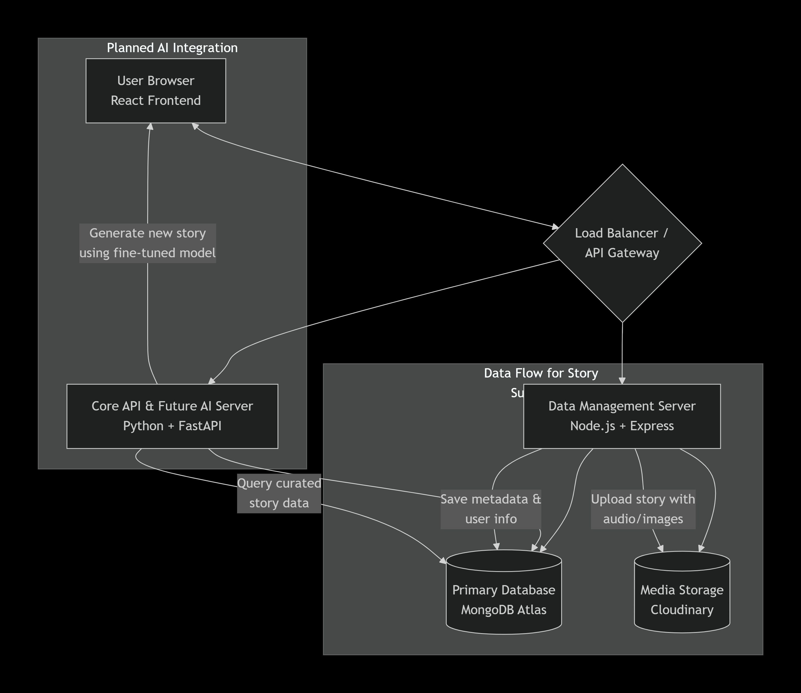
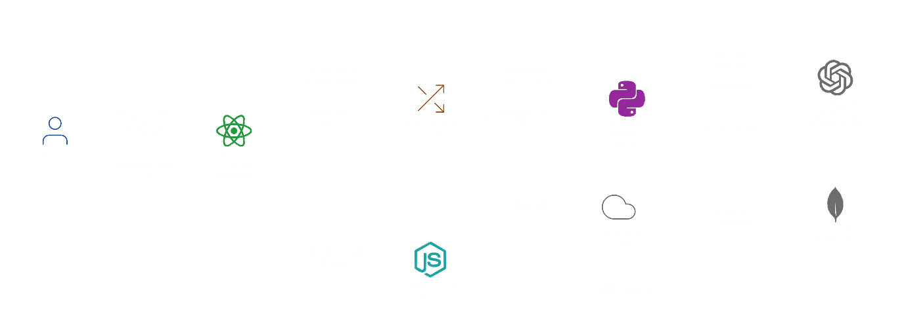

# FolkloreGPT: AI-Powered Indigenous Storyteller
## Phase 1: The Data Foundation

**🎯 Hackathon Theme:** AI/ML (Natural Language Processing, Cultural Preservation)
**📅 Round 1 Submission**

### 📖 The Problem
Indigenous languages, oral histories, and folklore are at risk of being lost. Current digital archives are often static, lacking interactive and engaging ways to preserve and share these living narratives in their authentic, multimodal forms (story, voice, imagery).

### 💡 Our Vision & Solution
We are building **FolkloreGPT**, a platform that uses AI to generate and share culturally-grounded stories. We believe a responsible AI must be built on a foundation of authentic, well-structured data.

For **Round 1**, we focused on **Phase 1: Building "FolkloreBase"** – a robust, full-stack data collection and management platform. This system is designed to gather the high-quality, rich folklore data (text, audio, images) necessary to train a future AI model that is accurate, respectful, and culturally aware.

3. System Architecture & Data Flow

The core logic of our prototype is a dual-backend architecture that separates data ingestion from AI processing, ensuring scalability and clean data flow for model training.

*Diagram showing user interaction with frontend, dual backend servers, and data storage systems*

## Flow Explanation:
Here's how our system works in practice:
1. **The React Frontend** is where users interact with everything. It's built with a component library we set up, and it handles forms for stories and media uploads.
2. **The Node.js Data Server (`server.js`)** is our workhorse for handling uploads. When a user submits a story with an audio recording or image, this server takes over. It uses the `multer` library to process files, uploads them to our Cloudinary cloud storage, and then saves all the important info—like the story's cultural origin, language, and narrator—into our MongoDB database. We spent time getting the error handling right here so files don't get lost.
3. **The Python FastAPI Server (`server.py`)** is set up as our main API hub. For now, it handles basic app requests, but we've deliberately built it to be the future home for our AI model. All the endpoints are structured so that adding the story generator later will be straightforward.
4. **Why two backends?** We separated them so our data collection is rock-solid and never goes down, even while we're testing or updating the AI part in the future. It just makes the whole system more stable.

## 4. Prototype Demonstration
For Round 1, we focused on solving the biggest problem first: **how do you reliably collect and store the complex folklore data an AI needs to learn?** Our prototype is a fully-working pipeline for this.

## 5. Our Plan for Round 2: Building the "GPT" Part
Our big goal for the next round is to plug the AI storytelling engine into the data platform we just built. Here’s our concrete, step-by-step plan:

### Phase 1: Integrate the Core AI Model
- **Add AI Libraries:** First, we'll add the necessary `transformers` and `torch` libraries to our `backend/requirements.txt` file.
- **Create the AI Endpoint:** In our existing `server.py`, we will implement a new `POST /api/generate` endpoint to handle story generation requests.
- **Fine-tune a Starter Model:** We'll begin by fine-tuning a capable but efficient model, like **`google/flan-t5-base`**, on the collection of stories we gather through our current platform.

### Phase 2: Enhance Our Data for AI Training
- **Build a Data Cleaning Pipeline:** We'll write Python scripts to systematically extract, clean, and structure the `storyText` and cultural metadata from our MongoDB database.
- **Implement a RAG System:** To make the AI's stories more accurate and grounded, we'll set up a Retrieval-Augmented Generation (RAG) pipeline. This allows the model to reference specific stories and facts from our own folklore database before generating a response.

### Phase 3: Launch Advanced Features & Go Live
- **Add Voice to Stories:** We'll leverage the `audioFiles` structure we already have to integrate a text-to-speech service, turning the AI's written stories into spoken-word audio.
- **Prepare for Deployment:** Finally, we'll containerize our entire dual-backend system using Docker. This will allow us to deploy the complete FolkloreGPT platform reliably on a cloud service like AWS or Azure.

## 👥 Team
- **Mansi Shrivastav** - Backend development & database design
- **Pankaj Singh** - Full-stack development & system architecture
- **Priyanka Sharma** - Frontend development & UI/UX
- **MD Arif** - Project coordination & documentation

## expanding the readme for round 2

### 📊 System Diagrams

*Diagram showing data flow through our system*

*MongoDB Stories collection schema*
